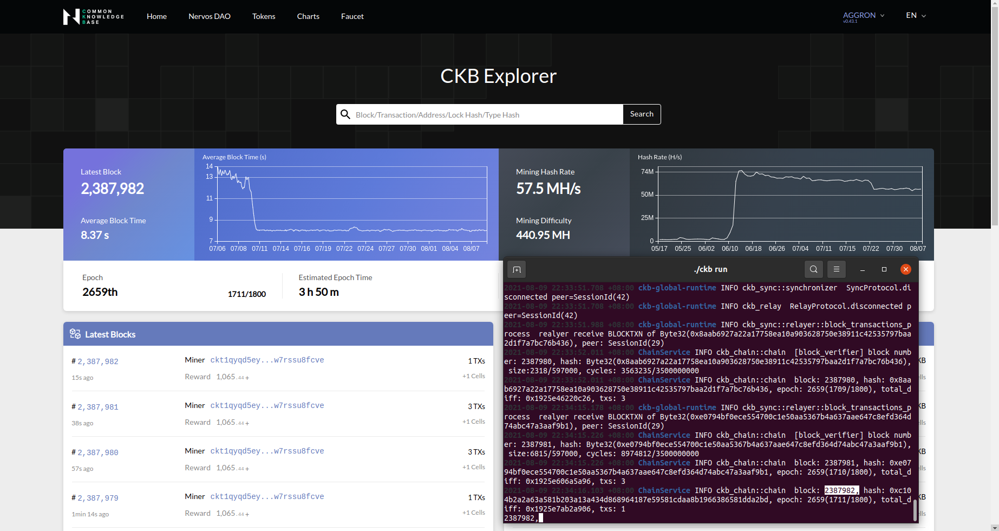

# Task 0) Setup A Local CKB Node And CKB Indexer For The Testnet

### Issue
https://gitcoin.co/issue/nervosnetwork/grants/1/100026176

### ScreenShot
1. A screenshot of the console output from your local Testnet CKB Node after it has fully synchronized with the network.
---

2. A screenshot of the console output from your local CKB Indexer after it has fully synchronized with the local Testnet CKB Node.
---
