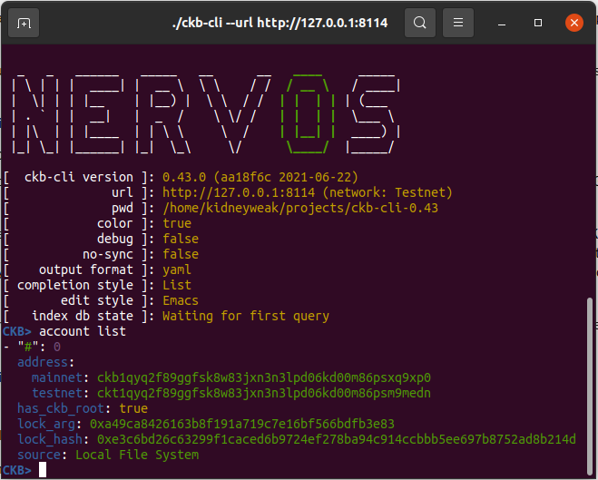
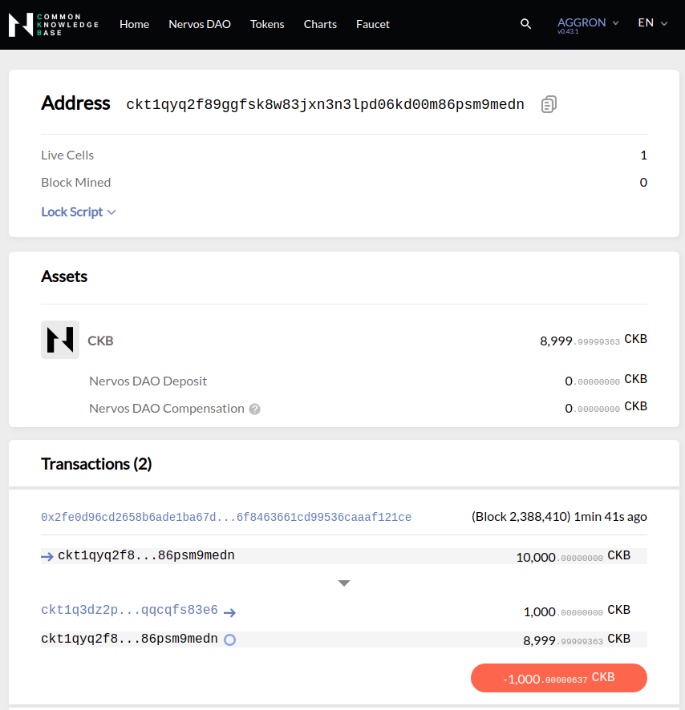
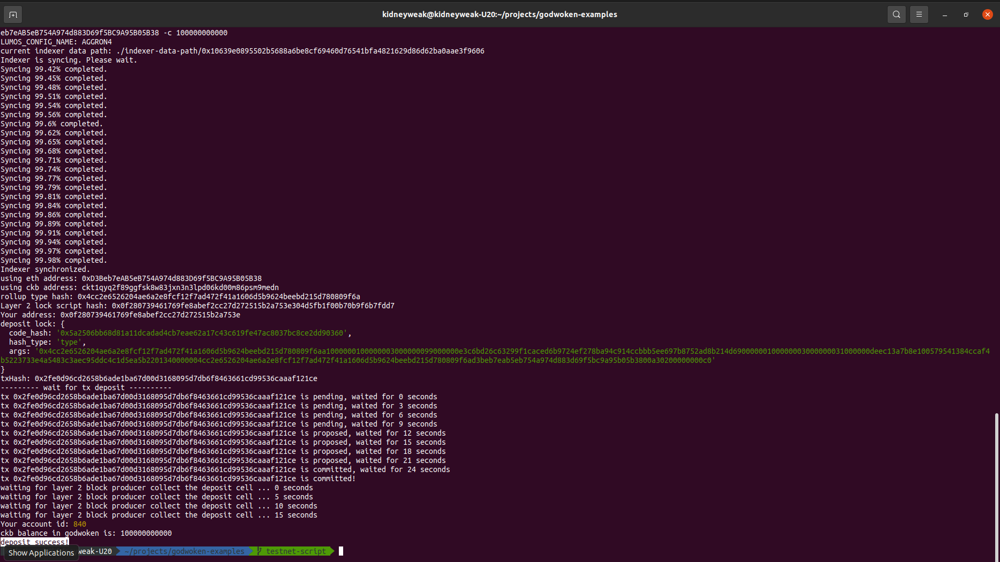

# Task 1) Create A Godwoken Account On The EVM Layer 2 Testnet

### Issue
https://gitcoin.co/issue/nervosnetwork/grants/2/100026208

### ScreenShot
1. A screenshot of the accounts you created (account list) in ckb-cli.
---

2. A link to the Layer 1 address you funded on the Testnet Explorer.
---
addr: https://explorer.nervos.org/aggron/address/ckt1qyq2f89ggfsk8w83jxn3n3lpd06kd00m86psm9medn

3. A screenshot of the console output immediately after you have successfully submitted a deposit to Layer 2.
---
transaction tx: https://explorer.nervos.org/aggron/transaction/0x2fe0d96cd2658b6ade1ba67d00d3168095d7db6f8463661cd99536caaaf121ce

