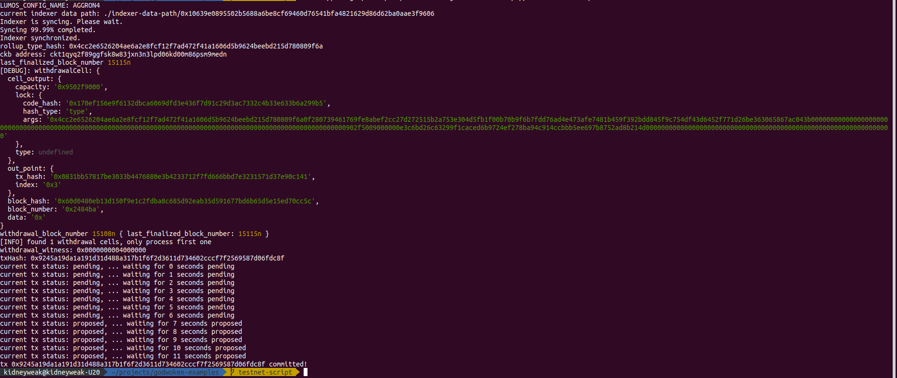

# Task 10) Complete Withdrawal Process By Unlocking The Funds

### Issue
https://gitcoin.co/issue/nervosnetwork/grants/11/100026217

### Task Submission
1. A screenshot of the console output immediately after running the "unlock" command.
---
tx: `0x9245a19da1a191d31d488a317b1f6f2d3611d734602cccf7f2569587d06fdc8f`

2. The Ethereum address that you've used for your Layer 2 account (in text format).
---
`0xD3Beb7eAB5eB754A974d883D69f5BC9A95B05B38`

3. The Nervos Layer 1 address associated with the private key passed to "unlock" command (in text format). This is "ckb address" in the console output.
---
`ckt1qyq2f89ggfsk8w83jxn3n3lpd06kd00m86psm9medn`

### **P.S.** suggestion
> request send : 2021/08/10 2AM(UTC) -> withdraw :2021/08/16 4PM(UTC)

It spends me almost 7 days of waiting unlock the assets. I think wait to unlock assets from layer 2 cannot be satisfied to layer1 users. I hope there maybe can have some auto unlock assets bot (like liquidation bot) which can get some profit. Auto unlock assets can surely improve UX on L2 -> L1. 

