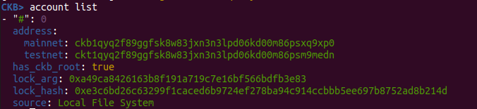
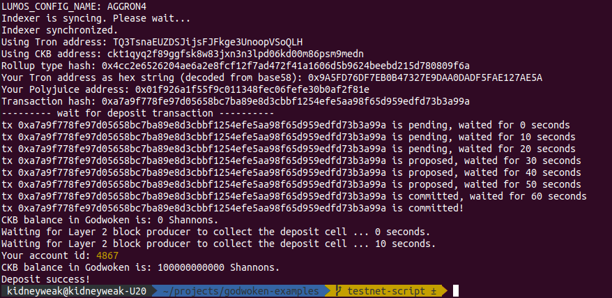
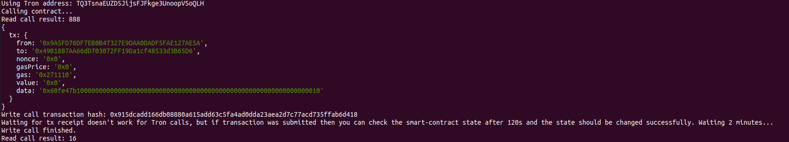

# Task 11) Use A Tron Wallet To Execute A Smart Contract Call

### Issue
https://gitcoin.co/issue/nervosnetwork/grants/15/100026366

1. A screenshot of the accounts you created (account list) in ckb-cli.
---


2. A link to the Layer 1 address you funded on the Testnet Explorer.
---
[https://explorer.nervos.org/aggron/address/ckt1qyq2f89ggfsk8w83jxn3n3lpd06kd00m86psm9medn](https://explorer.nervos.org/aggron/address/ckt1qyq2f89ggfsk8w83jxn3n3lpd06kd00m86psm9medn)

3. A screenshot of the console output immediately after you have successfully submitted a CKByte deposit to your Tron account on Layer 2.
---


4. A screenshot of the console output immediately after you have successfully issued a smart contract calls on Layer 2.
---


5. The transaction hash of the "Contract call" from the console output (in text format).
---
Write call transaction hash: `0x915dcadd166db08880a615add63c5fa4ad0dda23aea2d7c77acd735ffab6d418`


6. The contract address that you called (in text format).
---
Deployed contract address: `0x49B1887AA66dD703072FF19Da1cf48533d3B65D6`

7. The ABI for contract you made a call on (in text format).
---
```json
[
    {
      "inputs": [],
      "stateMutability": "payable",
      "type": "constructor"
    },
    {
      "inputs": [
        {
          "internalType": "uint256",
          "name": "x",
          "type": "uint256"
        }
      ],
      "name": "set",
      "outputs": [],
      "stateMutability": "payable",
      "type": "function"
    },
    {
      "inputs": [],
      "name": "get",
      "outputs": [
        {
          "internalType": "uint256",
          "name": "",
          "type": "uint256"
        }
      ],
      "stateMutability": "view",
      "type": "function"
    }
]
```

8. Your Tron address (in text format).
---
Tron address: `TQ3TsnaEUZDSJijsFJFkge3UnoopVSoQLH`