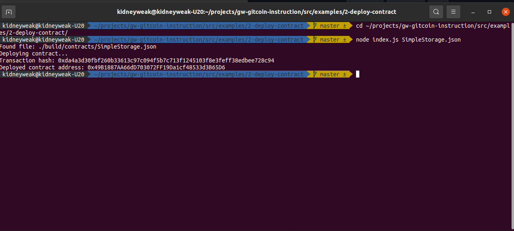

# Task 2) Deploy A Simple Ethereum Smart Contract On Polyjuice

### Issue
https://gitcoin.co/issue/nervosnetwork/grants/3/100026209

### Task Submission
1. A screenshot of the console output immediately after you have successfully deployed a smart contract.
---

2. The transaction hash from the contract deployment (in text format).
---
Transaction hash: 0xda4a3d30fbf260b33613c97c094f5b7c713f1245103f8e3feff38edbee728c94

3. The deployed contract address from the contract deployment (in text format).
---
Deployed contract address: 0x49B1887AA66dD703072FF19Da1cf48533d3B65D6

