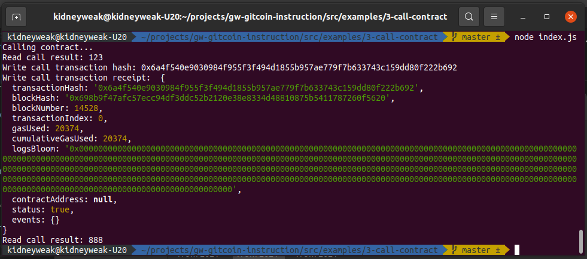

# Task 3) Issue A Smart Contract Call To The Deployed Smart Contract

### Issue
https://gitcoin.co/issue/nervosnetwork/grants/4/100026210

### Task Submission
1. A screenshot of the console output immediately after you have successfully issued a smart contract call.
---


2. The transaction hash from the console output (in text format).
---
transaction hash: `0x6a4f540e9030984f955f3f494d1855b957ae779f7b633743c159dd80f222b692`

3. The contract address that you called (in text format).
---
Deployed contract address: `0x49B1887AA66dD703072FF19Da1cf48533d3B65D6`

4. The ABI for contract you made a call on (in text format).
---
```json
[
    {
      "inputs": [],
      "stateMutability": "payable",
      "type": "constructor"
    },
    {
      "inputs": [
        {
          "internalType": "uint256",
          "name": "x",
          "type": "uint256"
        }
      ],
      "name": "set",
      "outputs": [],
      "stateMutability": "payable",
      "type": "function"
    },
    {
      "inputs": [],
      "name": "get",
      "outputs": [
        {
          "internalType": "uint256",
          "name": "",
          "type": "uint256"
        }
      ],
      "stateMutability": "view",
      "type": "function"
    }
]
```