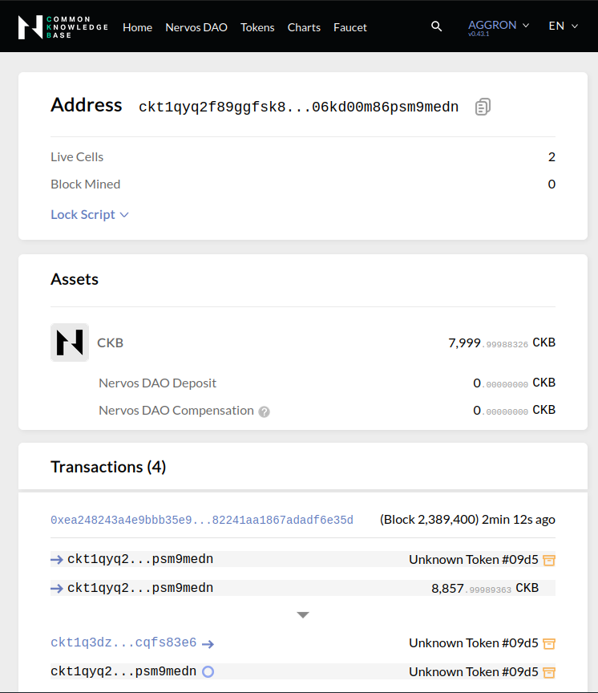
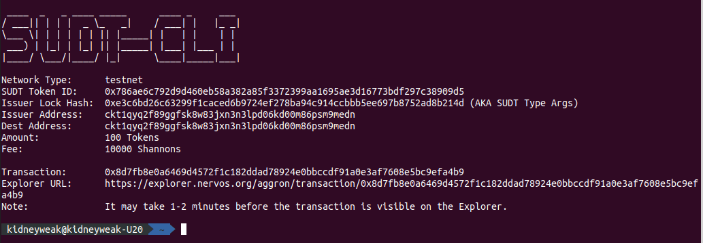
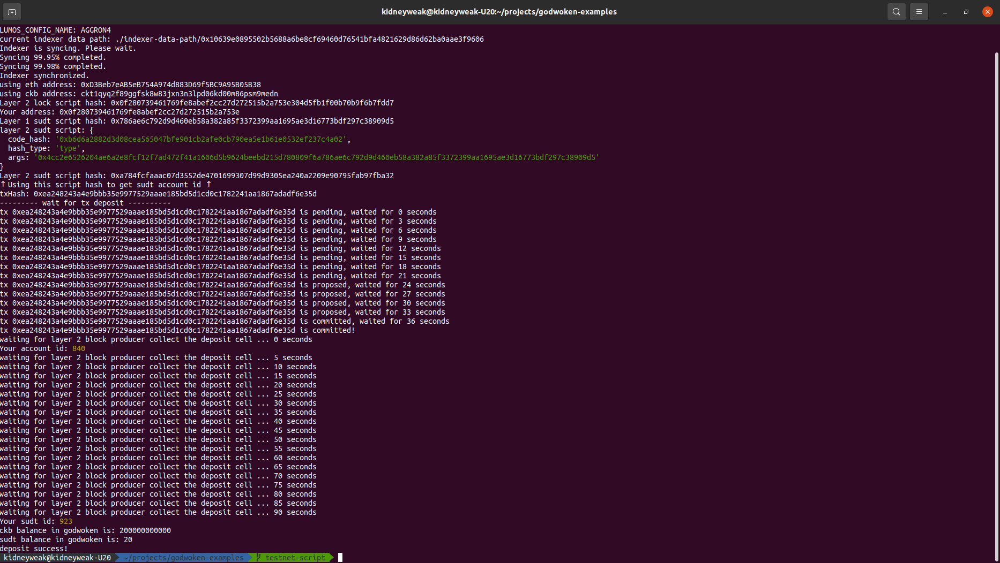

# Task 4) Issue An SUDT Token On Layer 1 And Deposit It To Layer 2

### Issue
https://gitcoin.co/issue/nervosnetwork/grants/5/100026211

### Task Submission
1. A link to the Layer 1 address you funded on the Testnet Explorer.
---
addr: [ckt1qyq2f89ggfsk8w83jxn3n3lpd06kd00m86psm9medn](https://explorer.nervos.org/aggron/address/ckt1qyq2f89ggfsk8w83jxn3n3lpd06kd00m86psm9medn)

2. A screenshot of the console output immediately after using sudt-cli to create your SUDT tokens on Layer 1.
---

3. A link to the transaction ID created by sudt-cli on the Testnet Explorer.
---
https://explorer.nervos.org/aggron/transaction/0x8d7fb8e0a6469d4572f1c182ddad78924e0bbccdf91a0e3af7608e5bc9efa4b9

4. A screenshot of the console output immediately after you have successfully submitted a deposit to Layer 2 using the account-cli tool.
---

5. The SUDT ID from the console output after executing the deposit script (in text format).
---
sudt id: `923`