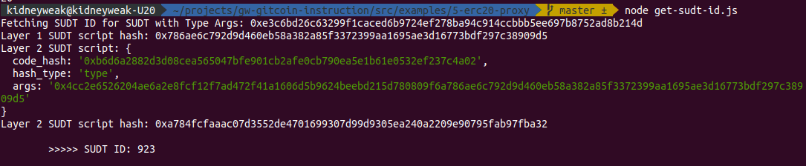

# Task 5) Deploy The ERC20 Proxy Contract For The Deposited SUDT

### Issue
https://gitcoin.co/issue/nervosnetwork/grants/6/100026212

### Task Submission
1. A screenshot of the console output immediately after deploying smart contract.
---

2. The address of the ERC20 Proxy Contract you deployed (in text format).
---
`0xadd5c6Ed38Ec47BB2c643e94fF3cb7768978FB94`

3. A screenshot of the console output immediately after checking your SUDT balance.
---

4. The Ethereum address that was checked (in text format).
---
`0xD3Beb7eAB5eB754A974d883D69f5BC9A95B05B38`

Bonus: Get SUDT ID
---
 