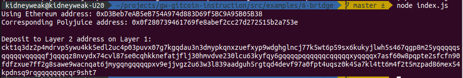

# Task 6) Use Force Bridge To Deposit Tokens From Ethereum To Polyjuice

### Issue
https://gitcoin.co/issue/nervosnetwork/grants/7/100026213

### Task Submission
1. A screenshot of the console output immediately after you have successfully generated your Deposit Receiver Address.
---

2. Your Deposit Receiver Address (in text format).
---
`ckt1q3dz2p4mdrvp5ywu4kk5edl2uc4p03puvx07g7kgqdau3n3dmypkqnxzuefxyp9wdghglncj77k5wt6p59sx6kukyjlwh5s467qgp8m25yqqqqqsqqqqqvqqqqqfjqqqqz8nvydx74cvl87se0cqhkknefatjflj30hmvdve230lcu63kyfqy6gqqqqpqqqqqqcqqqqqxyqqqqx7asf60w8pqpte2sfcfn90fdfzxue7ff2g8sawe9wacnqat6jmygqngqqqqpxv9ejjvgz2u63w3l839aadguh5rgtqd4devf97a0fpt4uqsz0k45a7kl4tt6m4f2t5mzpad86mex54kpdnsq9rqgqqqqqqcqr9sht7`

3. The Ethereum address used to generate the Deposit Receiver Address (in text format).
---
`0xD3Beb7eAB5eB754A974d883D69f5BC9A95B05B38`

3. A link to the Etherscan explorer for the successful Force Bridge transaction. This can be found on Force Bridge under History→Succeed.
---
Link: https://rinkeby.etherscan.io/tx/0x2e9b05ade85770ea68facca075625fdd4ff7340f05fc5a4aa58d8e5b33a25754

4. A link to the Nervos explorer for the successful Force bridge transaction. This can be found on Force Bridge under History→Succeed.
---
Link: https://explorer.nervos.org/aggron/transaction/0xba68ea70e7dc7f9043b80d35637253b3deccb1af758ee613567661f76c63411b