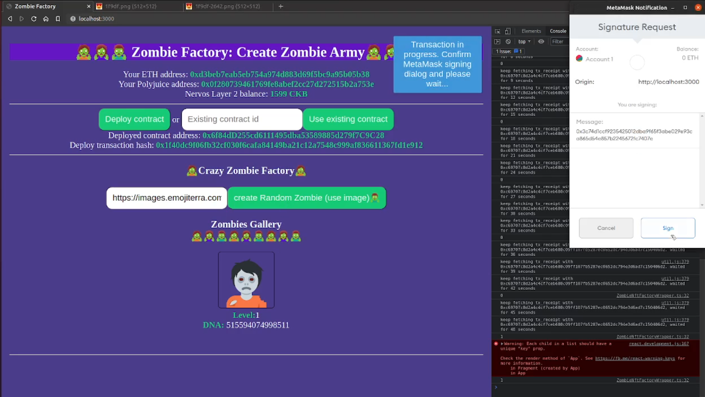

# Task 7) Port An Existing Ethereum DApp To Polyjuice

### Issue
https://gitcoin.co/issue/nervosnetwork/grants/8/100026214

### Task Submission
1. Screenshots or video of your application running on Godwoken.
Youtube Video Link: https://youtu.be/GuXyKl0OZuU


2. Link to the GitHub repository with your application which has been ported to Godwoken. This must be a different application than the one covered in this guide.

Github repo Link: https://github.com/kidneyweakx/blockchain-workshop/tree/nervos-hackthon

3. If you deployed any smart contracts as part of this tutorial, please provide the transaction hash of the deployment transaction, the deployed contract address, and the ABI of the deployed smart contract. (Provide all in text format.)

Deployed contract address: `0x6f84dD255cd6111495dba53589885d279f7C9C28`
Deploy transaction hash: `0x1f40dc9f06fb32cf030f6cafa84149ba21c12a7548c999af836611367fd1e912`

### ABI
```{json}
[
    {
      "inputs": [],
      "stateMutability": "nonpayable",
      "type": "constructor"
    },
    {
      "anonymous": false,
      "inputs": [
        {
          "indexed": true,
          "internalType": "address",
          "name": "owner",
          "type": "address"
        },
        {
          "indexed": true,
          "internalType": "address",
          "name": "approved",
          "type": "address"
        },
        {
          "indexed": true,
          "internalType": "uint256",
          "name": "tokenId",
          "type": "uint256"
        }
      ],
      "name": "Approval",
      "type": "event"
    },
    {
      "anonymous": false,
      "inputs": [
        {
          "indexed": true,
          "internalType": "address",
          "name": "owner",
          "type": "address"
        },
        {
          "indexed": true,
          "internalType": "address",
          "name": "operator",
          "type": "address"
        },
        {
          "indexed": false,
          "internalType": "bool",
          "name": "approved",
          "type": "bool"
        }
      ],
      "name": "ApprovalForAll",
      "type": "event"
    },
    {
      "anonymous": false,
      "inputs": [
        {
          "indexed": false,
          "internalType": "uint256",
          "name": "zombieId",
          "type": "uint256"
        },
        {
          "indexed": false,
          "internalType": "string",
          "name": "name",
          "type": "string"
        },
        {
          "indexed": false,
          "internalType": "uint256",
          "name": "dna",
          "type": "uint256"
        }
      ],
      "name": "NewZombie",
      "type": "event"
    },
    {
      "anonymous": false,
      "inputs": [
        {
          "indexed": true,
          "internalType": "address",
          "name": "from",
          "type": "address"
        },
        {
          "indexed": true,
          "internalType": "address",
          "name": "to",
          "type": "address"
        },
        {
          "indexed": true,
          "internalType": "uint256",
          "name": "tokenId",
          "type": "uint256"
        }
      ],
      "name": "Transfer",
      "type": "event"
    },
    {
      "inputs": [
        {
          "internalType": "address",
          "name": "to",
          "type": "address"
        },
        {
          "internalType": "uint256",
          "name": "tokenId",
          "type": "uint256"
        }
      ],
      "name": "approve",
      "outputs": [],
      "stateMutability": "nonpayable",
      "type": "function"
    },
    {
      "inputs": [
        {
          "internalType": "address",
          "name": "owner",
          "type": "address"
        }
      ],
      "name": "balanceOf",
      "outputs": [
        {
          "internalType": "uint256",
          "name": "",
          "type": "uint256"
        }
      ],
      "stateMutability": "view",
      "type": "function"
    },
    {
      "inputs": [
        {
          "internalType": "uint256",
          "name": "tokenId",
          "type": "uint256"
        }
      ],
      "name": "getApproved",
      "outputs": [
        {
          "internalType": "address",
          "name": "",
          "type": "address"
        }
      ],
      "stateMutability": "view",
      "type": "function"
    },
    {
      "inputs": [
        {
          "internalType": "address",
          "name": "owner",
          "type": "address"
        },
        {
          "internalType": "address",
          "name": "operator",
          "type": "address"
        }
      ],
      "name": "isApprovedForAll",
      "outputs": [
        {
          "internalType": "bool",
          "name": "",
          "type": "bool"
        }
      ],
      "stateMutability": "view",
      "type": "function"
    },
    {
      "inputs": [],
      "name": "name",
      "outputs": [
        {
          "internalType": "string",
          "name": "",
          "type": "string"
        }
      ],
      "stateMutability": "view",
      "type": "function"
    },
    {
      "inputs": [
        {
          "internalType": "uint256",
          "name": "tokenId",
          "type": "uint256"
        }
      ],
      "name": "ownerOf",
      "outputs": [
        {
          "internalType": "address",
          "name": "",
          "type": "address"
        }
      ],
      "stateMutability": "view",
      "type": "function"
    },
    {
      "inputs": [
        {
          "internalType": "address",
          "name": "from",
          "type": "address"
        },
        {
          "internalType": "address",
          "name": "to",
          "type": "address"
        },
        {
          "internalType": "uint256",
          "name": "tokenId",
          "type": "uint256"
        }
      ],
      "name": "safeTransferFrom",
      "outputs": [],
      "stateMutability": "nonpayable",
      "type": "function"
    },
    {
      "inputs": [
        {
          "internalType": "address",
          "name": "from",
          "type": "address"
        },
        {
          "internalType": "address",
          "name": "to",
          "type": "address"
        },
        {
          "internalType": "uint256",
          "name": "tokenId",
          "type": "uint256"
        },
        {
          "internalType": "bytes",
          "name": "_data",
          "type": "bytes"
        }
      ],
      "name": "safeTransferFrom",
      "outputs": [],
      "stateMutability": "nonpayable",
      "type": "function"
    },
    {
      "inputs": [
        {
          "internalType": "address",
          "name": "operator",
          "type": "address"
        },
        {
          "internalType": "bool",
          "name": "approved",
          "type": "bool"
        }
      ],
      "name": "setApprovalForAll",
      "outputs": [],
      "stateMutability": "nonpayable",
      "type": "function"
    },
    {
      "inputs": [
        {
          "internalType": "bytes4",
          "name": "interfaceId",
          "type": "bytes4"
        }
      ],
      "name": "supportsInterface",
      "outputs": [
        {
          "internalType": "bool",
          "name": "",
          "type": "bool"
        }
      ],
      "stateMutability": "view",
      "type": "function"
    },
    {
      "inputs": [],
      "name": "symbol",
      "outputs": [
        {
          "internalType": "string",
          "name": "",
          "type": "string"
        }
      ],
      "stateMutability": "view",
      "type": "function"
    },
    {
      "inputs": [
        {
          "internalType": "uint256",
          "name": "tokenId",
          "type": "uint256"
        }
      ],
      "name": "tokenURI",
      "outputs": [
        {
          "internalType": "string",
          "name": "",
          "type": "string"
        }
      ],
      "stateMutability": "view",
      "type": "function"
    },
    {
      "inputs": [
        {
          "internalType": "address",
          "name": "from",
          "type": "address"
        },
        {
          "internalType": "address",
          "name": "to",
          "type": "address"
        },
        {
          "internalType": "uint256",
          "name": "tokenId",
          "type": "uint256"
        }
      ],
      "name": "transferFrom",
      "outputs": [],
      "stateMutability": "nonpayable",
      "type": "function"
    },
    {
      "inputs": [
        {
          "internalType": "uint256",
          "name": "",
          "type": "uint256"
        }
      ],
      "name": "zombies",
      "outputs": [
        {
          "internalType": "string",
          "name": "name",
          "type": "string"
        },
        {
          "internalType": "uint256",
          "name": "dna",
          "type": "uint256"
        },
        {
          "internalType": "uint32",
          "name": "level",
          "type": "uint32"
        }
      ],
      "stateMutability": "view",
      "type": "function"
    },
    {
      "inputs": [
        {
          "internalType": "string",
          "name": "_name",
          "type": "string"
        }
      ],
      "name": "createRandomZombie",
      "outputs": [],
      "stateMutability": "nonpayable",
      "type": "function"
    },
    {
      "inputs": [
        {
          "internalType": "uint256",
          "name": "id",
          "type": "uint256"
        }
      ],
      "name": "getZombie",
      "outputs": [
        {
          "components": [
            {
              "internalType": "string",
              "name": "name",
              "type": "string"
            },
            {
              "internalType": "uint256",
              "name": "dna",
              "type": "uint256"
            },
            {
              "internalType": "uint32",
              "name": "level",
              "type": "uint32"
            }
          ],
          "internalType": "struct ZombieNftFactory.Zombie",
          "name": "",
          "type": "tuple"
        }
      ],
      "stateMutability": "view",
      "type": "function"
    },
    {
      "inputs": [],
      "name": "getZombieLength",
      "outputs": [
        {
          "internalType": "uint256",
          "name": "",
          "type": "uint256"
        }
      ],
      "stateMutability": "view",
      "type": "function"
    }
  ]
```