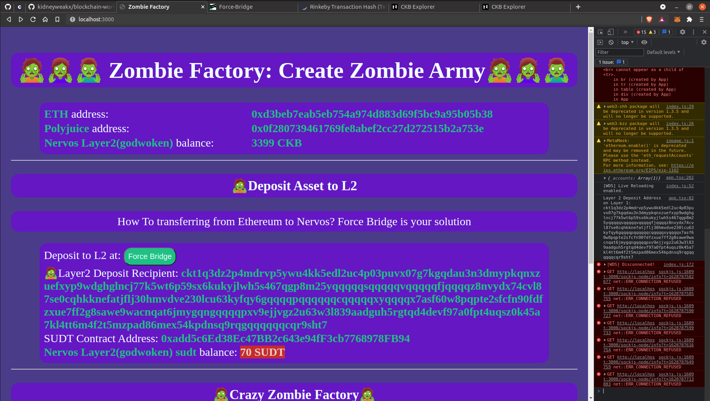

# Task 8) Modify The Ported DApp So It Supports Ethereum Assets Via Force Bridge

### Issue
https://gitcoin.co/issue/nervosnetwork/grants/9/100026215

### Task Submission
1. A screenshot or video of your EVM application on Layer 2 with Force Bridge support.
---
Youtube Video Link: https://youtu.be/pg9a01faYJU


2. The address of the SUDT-ERC20 Proxy Contract that you deployed (in text format).
---
```sh
0xadd5c6Ed38Ec47BB2c643e94fF3cb7768978FB94
```

3. A link to the GitHub repository with your EVM application that integrates Force Bridge support.
---

Github Link: https://github.com/kidneyweakx/blockchain-workshop/tree/nervos-task8