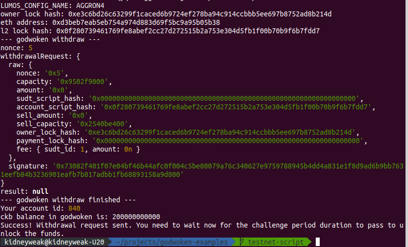

# Task 9) Initiate Withdrawal Process From The Layer 2 Back To Layer 1

### Issue
https://gitcoin.co/issue/nervosnetwork/grants/10/100026216

### Task Submission
1. A screenshot of the console output immediately after running the withdraw command.
---

2. The Ethereum address that you've used for your Layer 2 account (in text format).
---
`0xD3Beb7eAB5eB754A974d883D69f5BC9A95B05B38`

3. The Nervos Layer 1 address that you passed to withdraw command (in text format).
---
`ckt1qyq2f89ggfsk8w83jxn3n3lpd06kd00m86psm9medn`